# CPU Scheduler RL

<p align="center">
  <strong>Classical CPU Scheduling × Reinforcement Learning × Intelligent Benchmarking</strong>
</p>

<p align="center">
  A CPU scheduling simulator that compares traditional operating system algorithms against a custom PPO-based reinforcement learning agent, with optional Groq-powered performance analysis.
</p>

<p align="center">
  
  
  
  
  
</p>

---

## Overview

CPU Scheduler RL is an end-to-end simulation and benchmarking platform for exploring how classical CPU scheduling algorithms compare with a learned reinforcement learning policy.

The system simulates process execution tick by tick, supports dynamic process arrivals, generates Gantt charts, calculates scheduling metrics, and evaluates algorithms on identical workloads.

An optional Groq LLM analyst, powered by `openai/gpt-oss-120b`, provides higher-level explanations of workload characteristics and benchmark outcomes.

The project combines operating systems, simulation, reinforcement learning, and AI-powered experiment analysis in a single reproducible platform.

## Highlights

* Classical CPU scheduling simulation with five baseline algorithms.
* PPO-based reinforcement learning scheduler.
* Randomized workloads for training and evaluation.
* Configurable Round Robin time quantum.
* Gymnasium-compatible RL environment.
* Common simulation engine and benchmarking metrics.
* CLI-based inference and experiment execution.
* Gantt chart visualization and CSV export.
* Optional Groq LLM benchmark analysis.
* Mock Mode for API-independent development.
* Unit tests for scheduling correctness and environment behavior.
* Designed for free, local-first execution.

---

## Supported Scheduling Algorithms

| Algorithm   | Scheduling Type | Description                                           |
| :---------- | :-------------: | :---------------------------------------------------- |
| FCFS        |  Non-preemptive | Executes processes in arrival order.                  |
| SJF         |  Non-preemptive | Selects the shortest available CPU burst.             |
| SRTF        |    Preemptive   | Selects the process with the shortest remaining time. |
| Priority    |  Non-preemptive | Selects the highest-priority ready process.           |
| Round Robin |    Preemptive   | Cyclic scheduling using a configurable time quantum.  |
| PPO         |  Learned policy | Selects processes using a trained RL policy.          |

---

## Architecture

```mermaid
flowchart TD

subgraph group_benchmark["Benchmark logic"]
  node_core_benchmark["Benchmark core<br/>system boundary"]
  node_env_py["Env state<br/>deterministic env<br/>[env.py]"]
  node_tasks_py["Tasks<br/>task config<br/>[tasks.py]"]
  node_grader_py["Grader<br/>scorer<br/>[grader.py]"]
end

subgraph group_service["Service transport"]
  node_api_surface["API surface<br/>HTTP interface"]
  node_app_py["Local app<br/>entrypoint<br/>[app.py]"]
  node_server_app_py["Hosted app<br/>entrypoint<br/>[app.py]"]
end

subgraph group_clients["Client execution"]
  node_agent_py["Agent<br/>policy wrapper<br/>[agent.py]"]
  node_inference_py["Inference runner<br/>baseline runner<br/>[inference.py]"]
  node_model_api(("Model API<br/>external model"))
  node_sjf_fallback(("SJF fallback<br/>heuristic policy"))
end

subgraph group_deploy["Deployment"]
  node_dockerfile["Container build<br/>runtime image"]
  node_openenv_yaml["OpenEnv config<br/>deployment config<br/>[openenv.yaml]"]
  node_package_meta["Package setup<br/>python packaging"]
end

subgraph group_tests["Tests"]
  node_env_tests["Env tests<br/>test suite<br/>[test_env.py]"]
end

node_core_benchmark -->|"contains"| node_env_py
node_core_benchmark -->|"defines"| node_tasks_py
node_core_benchmark -->|"scores"| node_grader_py
node_api_surface -->|"drives"| node_env_py
node_api_surface -->|"lists"| node_tasks_py
node_api_surface -->|"exposes"| node_grader_py
node_app_py -->|"serves"| node_api_surface
node_server_app_py -->|"serves"| node_api_surface
node_agent_py -->|"acts on"| node_env_py
node_inference_py -->|"uses"| node_agent_py
node_inference_py -->|"calls"| node_model_api
node_inference_py -->|"falls back to"| node_sjf_fallback
node_inference_py -->|"drives"| node_api_surface
node_env_tests -->|"verifies"| node_env_py
node_dockerfile -->|"packages"| node_app_py
node_openenv_yaml -->|"deploys"| node_server_app_py
node_package_meta -.->|"supports"| node_app_py
node_package_meta -.->|"supports"| node_server_app_py

click node_env_py "https://github.com/ritam-05/cpu-scheduler-rl/blob/main/env.py"
click node_tasks_py "https://github.com/ritam-05/cpu-scheduler-rl/blob/main/tasks.py"
click node_grader_py "https://github.com/ritam-05/cpu-scheduler-rl/blob/main/grader.py"
click node_app_py "https://github.com/ritam-05/cpu-scheduler-rl/blob/main/app.py"
click node_server_app_py "https://github.com/ritam-05/cpu-scheduler-rl/blob/main/server/app.py"
click node_agent_py "https://github.com/ritam-05/cpu-scheduler-rl/blob/main/agent.py"
click node_inference_py "https://github.com/ritam-05/cpu-scheduler-rl/blob/main/inference.py"
click node_env_tests "https://github.com/ritam-05/cpu-scheduler-rl/blob/main/tests/test_env.py"
click node_dockerfile "https://github.com/ritam-05/cpu-scheduler-rl/tree/main/Dockerfile"
click node_openenv_yaml "https://github.com/ritam-05/cpu-scheduler-rl/blob/main/openenv.yaml"

classDef toneNeutral fill:#f8fafc,stroke:#334155,stroke-width:1.5px,color:#0f172a
classDef toneBlue fill:#dbeafe,stroke:#2563eb,stroke-width:1.5px,color:#172554
classDef toneAmber fill:#fef3c7,stroke:#d97706,stroke-width:1.5px,color:#78350f
classDef toneMint fill:#dcfce7,stroke:#16a34a,stroke-width:1.5px,color:#14532d
classDef toneRose fill:#ffe4e6,stroke:#e11d48,stroke-width:1.5px,color:#881337
classDef toneIndigo fill:#e0e7ff,stroke:#4f46e5,stroke-width:1.5px,color:#312e81
classDef toneTeal fill:#ccfbf1,stroke:#0f766e,stroke-width:1.5px,color:#134e4a
class node_core_benchmark,node_env_py,node_tasks_py,node_grader_py toneBlue
class node_api_surface,node_app_py,node_server_app_py toneAmber
class node_agent_py,node_inference_py,node_model_api,node_sjf_fallback toneMint
class node_dockerfile,node_openenv_yaml,node_package_meta toneRose
class node_env_tests toneIndigo
```



```text
                         CPU SCHEDULER RL
                                |
                                v
                       CLI / User Input
                                |
                                v
                  Workload Generator / JSON
                                |
                                v
                     Simulation Engine
                                |
                +---------------+---------------+
                |                               |
                v                               v
       Classical Schedulers              RL Environment
                |                               |
                |                               v
                |                         PPO Training
                |                               |
                |                               v
                |                         RL Inference
                |                               |
                +---------------+---------------+
                                |
                                v
                       Benchmark Engine
                                |
              +-----------------+-----------------+
              |                 |                 |
              v                 v                 v
          Metrics           Gantt Charts       CSV Export
                                |
                                v
                     Optional Groq Analyst
                                |
                                v
                    Experiment Interpretation
```

### Core components

| Component            | Responsibility                                              |
| :------------------- | :---------------------------------------------------------- |
| Simulation Engine    | Executes CPU scheduling tick by tick.                       |
| Classical Schedulers | Implements FCFS, SJF, SRTF, Priority, and RR.               |
| RL Environment       | Defines the CPU scheduling MDP using Gymnasium.             |
| PPO Agent            | Learns scheduling policies from randomized workloads.       |
| Benchmark Engine     | Evaluates algorithms using identical workloads.             |
| Visualization        | Generates Gantt charts and comparative plots.               |
| Groq Analyst         | Interprets workload and benchmark results.                  |
| CLI                  | Provides a unified interface for experiments and inference. |

---

## Reinforcement Learning

The CPU scheduling problem is modeled as a Markov Decision Process (MDP).

### Observation Space

The environment uses a normalized `np.float32` matrix:

```text
(max_processes, 5)
```

Each process contains:

| Feature          | Meaning                                                 |
| :--------------- | :------------------------------------------------------ |
| `is_present`     | Whether the process slot is active.                     |
| `is_ready`       | Whether the process has arrived and has remaining work. |
| `remaining_time` | CPU ticks required to complete the process.             |
| `priority`       | Static priority rank.                                   |
| `wait_time`      | Accumulated waiting time.                               |

### Action Space

```python
gymnasium.spaces.Discrete(max_processes)
```

Each action represents the process index selected for the next CPU scheduling decision.

Invalid actions are penalized, and deterministic inference includes a fallback policy that selects a valid ready process when necessary.

### Reward Function

The current dense reward design penalizes the number of processes waiting in the ready queue:

```text
Reward = -Ready Queue Size
```

Invalid action penalty:

```text
-10
```

The reward function is a configurable training objective. Final algorithm comparisons are performed using explicit scheduling metrics rather than reward alone.

### PPO Configuration

| Parameter           | Value     |
| :------------------ | :-------- |
| Algorithm           | PPO       |
| Policy              | MlpPolicy |
| Hidden Layers       | 128 × 128 |
| Learning Rate       | 0.0003    |
| Rollout Buffer      | 1024      |
| Batch Size          | 64        |
| Entropy Coefficient | 0.01      |

The agent trains on randomized workloads to reduce dependence on memorized schedules.

---

## Performance Metrics

All algorithms are evaluated using a common metrics engine.

| Metric           | Description                                           |
| :--------------- | :---------------------------------------------------- |
| Waiting Time     | Time spent waiting in the ready queue.                |
| Turnaround Time  | Completion time − Arrival time.                       |
| Response Time    | First CPU allocation − Arrival time.                  |
| Makespan         | Total elapsed time to complete the workload.          |
| Context Switches | Number of CPU execution switches between processes.   |
| CPU Utilization  | Proportion of elapsed time spent executing processes. |
| Throughput       | Number of completed processes per unit of time.       |

### Core formulas

```text
Turnaround Time = Completion Time - Arrival Time

Waiting Time = Turnaround Time - Burst Time

Response Time = First Start Time - Arrival Time

CPU Utilization = Busy CPU Time / Total Elapsed Time
```

---

## Groq LLM Analyst

The platform optionally integrates Groq's API using:

```text
Model: openai/gpt-oss-120b
Provider: Groq
```

The LLM analyst receives workload characteristics and comparative metrics to generate explanations such as:

* Why a scheduling algorithm performed well or poorly.
* How Round Robin's time quantum affected results.
* Why SJF or SRTF benefited from short CPU bursts.
* Whether the RL agent generalized to the evaluated workload.
* How workload characteristics influenced scheduling performance.
* What experiments could improve the RL policy.

The Groq LLM is a separate analysis component, not the PPO scheduling policy.

### Fault tolerance

If the Groq API key is unavailable or the request fails, Mock Mode allows the platform to continue running without crashing.

Configure the API key using an environment variable:

```powershell
$env:GROQ_API_KEY="your_api_key"
```

Never commit API keys to the repository.

---

## Project Structure

```text
cpu-scheduler-rl/
│
├── server/
│   ├── __init__.py
│   ├── app.py
│   └── tests/
│       └── test_env.py
│
├── src/
│   └── scheduler/
│       ├── models.py
│       ├── workload.py
│       ├── metrics.py
│       │
│       ├── algorithms/
│       │   ├── fcfs.py
│       │   ├── sjf.py
│       │   ├── srtf.py
│       │   ├── priority.py
│       │   └── round_robin.py
│       │
│       ├── simulation/
│       │   ├── engine.py
│       │   └── gantt.py
│       │
│       ├── rl/
│       │   ├── environment.py
│       │   ├── agent.py
│       │   └── train.py
│       │
│       ├── llm/
│       │   ├── groq_agent.py
│       │   └── prompts.py
│       │
│       ├── benchmark.py
│       └── cli.py
│
├── tests/
│   ├── test_algorithms.py
│   ├── test_env.py
│   ├── test_metrics.py
│   ├── test_rl.py
│   └── test_llm_agent.py
│
├── models/
├── workloads/
├── results/
├── scripts/
│   └── benchmark.py
│
├── agent.py
├── env.py
├── grader.py
├── inference.py
├── train.py
├── experiment.py
├── tasks.py
├── openenv.yaml
├── pyproject.toml
├── requirements.txt
├── Dockerfile
├── .env.example
└── README.md
```

---

## Installation

### Prerequisites

* Python 3.11 or newer.
* Windows, Linux, or macOS.
* CPU-compatible PyTorch installation.
* Optional Groq API key for LLM analysis.

### 1. Clone the repository

```bash
git clone <repository-url>
cd cpu-scheduler-rl
```

### 2. Create a virtual environment

```bash
python -m venv .venv
```

### 3. Activate the environment

Windows PowerShell:

```powershell
.\.venv\Scripts\Activate.ps1
```

macOS/Linux:

```bash
source .venv/bin/activate
```

### 4. Install dependencies

Using pip:

```bash
pip install -r requirements.txt
```

Using uv:

```bash
uv sync
```

### 5. Configure optional Groq integration

Create a `.env` file based on `.env.example`:

```env
GROQ_API_KEY=your_api_key
GROQ_MODEL=openai/gpt-oss-120b
```

If the API key is not configured, use Mock Mode.

---

## Usage

All commands below assume the virtual environment is activated.

### Run individual algorithms

FCFS:

```bash
python inference.py --algorithm fcfs --processes 5
```

SJF:

```bash
python inference.py --algorithm sjf --processes 5
```

SRTF:

```bash
python inference.py --algorithm srtf --processes 5
```

Priority Scheduling:

```bash
python inference.py --algorithm priority --processes 5
```

Round Robin with a custom time quantum:

```bash
python inference.py --algorithm rr --quantum 4 --processes 5
```

### Run the trained RL agent

```bash
python inference.py \
    --algorithm rl \
    --model models/ppo_scheduler.zip \
    --processes 5
```

### Train the RL agent

Default training:

```bash
python train.py
```

Custom training configuration:

```bash
python train.py \
    --timesteps 100000 \
    --processes 10
```

Custom output path and seed:

```bash
python train.py \
    --timesteps 50000 \
    --processes 8 \
    --output models/my_custom_model \
    --seed 123
```

### Run dynamic experiments

Standard experiment:

```bash
python experiment.py
```

Extended training:

```bash
python experiment.py --timesteps 250000
```

Disable Groq analysis:

```bash
python experiment.py --no-analyze
```

Reproducible experiment:

```bash
python experiment.py --seed 42
```

The dynamic experiment generates randomized workloads, trains an RL agent, evaluates the classical schedulers, compares results, and optionally invokes the Groq analyst.

### Run a complete benchmark

```bash
python inference.py \
    --algorithm benchmark \
    --processes 5
```

Benchmark with Groq analysis:

```bash
python inference.py \
    --algorithm benchmark \
    --processes 5 \
    --analyze
```

### Export results

Save metrics to CSV and a Gantt chart:

```bash
python inference.py \
    --algorithm sjf \
    --processes 5 \
    --csv results/sjf_metrics.csv \
    --gantt results/sjf_chart.png \
    --no-display
```

### Use a custom workload

```bash
python inference.py \
    --algorithm sjf \
    --workload workloads/sample.json
```

---

## Benchmarking Methodology

The benchmark engine evaluates algorithms on identical workloads to ensure a fair comparison.

The evaluation process:

```text
Generate Workloads
       |
       v
Run Classical Algorithms
       |
       v
Run Trained RL Policy
       |
       v
Calculate Common Metrics
       |
       v
Aggregate Results
       |
       v
Export CSV and Visualizations
       |
       v
Optional LLM Interpretation
```

### Reproducibility

* Fixed random seeds can be used for experiments.
* Workloads can be saved and loaded from JSON.
* Training, validation, and test workloads can be separated.
* Every algorithm receives the same workload during comparison.
* Raw and aggregate benchmark results can be exported.

### Important considerations

The RL agent is not assumed to outperform classical algorithms universally.

Performance depends on:

* Workload distribution.
* Reward function.
* Observation design.
* Training duration.
* Model architecture.
* Scheduling objective.

The project evaluates where RL provides useful scheduling behavior and where classical algorithms remain superior.

---

## Example Output

Illustrative terminal output:

```text
CPU Scheduler Benchmark
=======================

Workload: Random
Processes: 5

Algorithm          Avg WT    Avg TAT    Avg RT    Makespan
-----------------------------------------------------------
FCFS                 --         --        --         --
SJF                  --         --        --         --
SRTF                 --         --        --         --
Priority             --         --        --         --
Round Robin          --         --        --         --
RL (PPO)             --         --        --         --
```

Actual values are generated by the simulation and benchmark engine.

---

## Testing

Run the complete test suite:

```bash
pytest -v
```

Tests cover:

* Classical scheduling correctness.
* Process arrivals and completion.
* SRTF preemption.
* Round Robin quantum behavior.
* Metric calculations.
* Gantt chart generation.
* Gymnasium environment behavior.
* Observation and action validity.
* RL model loading.
* Groq Mock Mode.
* CLI validation.

---

## Technology Stack

| Technology        | Purpose                                   |
| :---------------- | :---------------------------------------- |
| Python            | Core implementation.                      |
| Gymnasium         | Reinforcement learning environment API.   |
| Stable-Baselines3 | PPO training and policy inference.        |
| PyTorch           | Neural network backend.                   |
| NumPy             | Numerical computation and observations.   |
| Pandas            | Benchmark data processing and CSV export. |
| Matplotlib        | Gantt charts and comparative plots.       |
| Tabulate          | Structured CLI tables.                    |
| Pytest            | Automated testing.                        |
| Groq              | Optional LLM-powered analysis.            |
| Docker            | Containerized execution.                  |

---

## Limitations

* Initial RL environment uses a fixed maximum process capacity.
* The observation space is based on a fixed-size process matrix.
* Training quality depends on workload distributions and reward design.
* Classical algorithms may outperform RL on simple workloads.
* The simulator primarily models CPU-bound process execution.
* Context-switch overhead may not fully reflect real hardware costs.
* Multi-core scheduling and I/O bursts are not the primary focus of the current version.
* Groq analysis depends on API availability and quotas.

---

## Future Improvements

* Multi-core CPU scheduling.
* Context-switch overhead modeling.
* I/O-bound processes and CPU/I/O burst patterns.
* Dynamic workload arrivals.
* Priority aging to reduce starvation.
* Variable-size process observations.
* Advanced action masking.
* Multi-objective reward optimization.
* Interactive scheduling dashboard.
* More RL algorithm comparisons.
* Hyperparameter optimization.
* Statistical significance testing.
* LLM-assisted experiment planning.
* Scheduling policy explainability.

---

## Engineering and Research Value

This project demonstrates practical experience in:

* Operating system scheduling algorithms.
* Discrete-time simulation.
* Ready queue management and process state transitions.
* Reinforcement learning environment design.
* Markov Decision Processes.
* PPO policy optimization.
* Neural network-based decision-making.
* Reproducible experimentation.
* Benchmark engineering.
* Performance metrics and visualization.
* LLM integration.
* Python architecture and testing.

---

## License

This project is licensed under the MIT License.

See the `LICENSE` file for details.

---

## Author

**Ritam**

A systems and AI project combining operating systems, reinforcement learning, and intelligent performance analysis.

<p align="center">
  <strong>CPU Scheduling, Reimagined with Reinforcement Learning.</strong>
</p>
